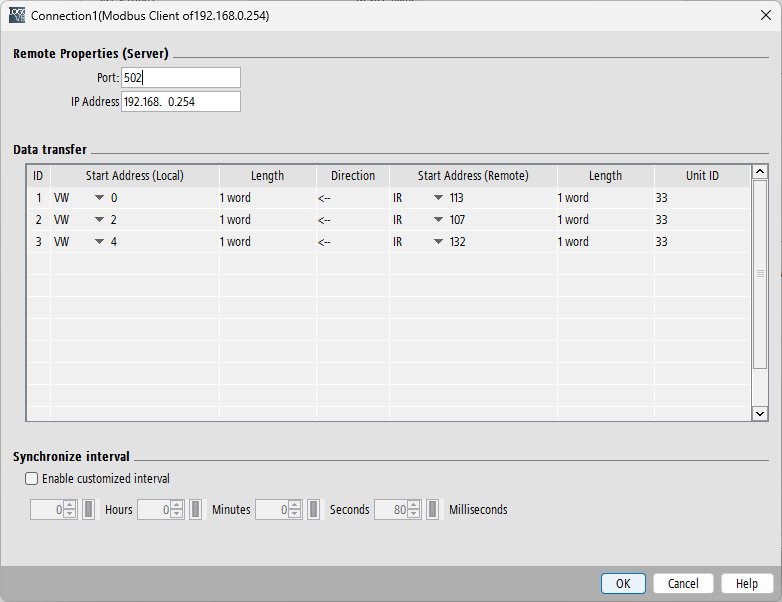

# LOGO!8 a Modbus/TCP
Návod pro nastavení komunikace mezi plc a měřákem připojeným prostřednictvím modbus tcp.

* [1 RTU/TCP Bridge](#1-rtutcp-bridge)
    * [1.1 Nastavení](#11-nastavení)
    * [1.2 Testování správnosti nastavení](#12-testování-správnosti-nastavení)
* [2 Nastavení LOGO!Soft comfort](#2-nastavení-logosoft-comfort)
    * [2.1 Nastavení](#21-nastavení)
        * [2.1.1 Adresy registrů](#211-adresy-registrů)

|Použitá zařízrní|
|-|
|LOGO!8 PLC|
|Papouch RTU/TCP converter|
|Finder 7M.38... Elektronický měřák s podporoou MODBUS|

## 1 RTU/TCP bridge

### 1.1 Nastavení

|Cíl nastavení|Cílová hodnota|Poznámka|
|-|-|-|
|IP|192.168.0.254|Adresu volíme podle potřeby (subnet musí být stejný jako PLC)|
|MODBUS port|502|Výchozí|
|Modbus Mode|Modbus RTU||
|Direction|Network > Serial||
|Modbus RTU ID|0|Výchozí, pro naše potřeby nemá na nic vliv|
|Baudrate|19 200 Bd|Musí být stejný jako baudrate měřáku|
|Serial Mode|8 data, no parity, 2 stop|Musí být stejné jako nastavení měřáku|

### 1.2 Testování správnosti nastavení

## 2 Nastavení LOGO!Soft comfort

### 2.1 Nastavení
Otevřeme nastavení projektu\

Nastavíme IP adresu PLC, povolíme modbus připojení a vytvoříme nové připojení\

Nastavíme IP a MODBUS bridge\

#### 2.1.1 Adresy registrů

LOGO! PLC počítají adresy od 1,narozdíl of virtuálně všechny ostatní zařizení, kté začínají od 0. Je tedy potřeba k cílovým adresám přidat 1.\

